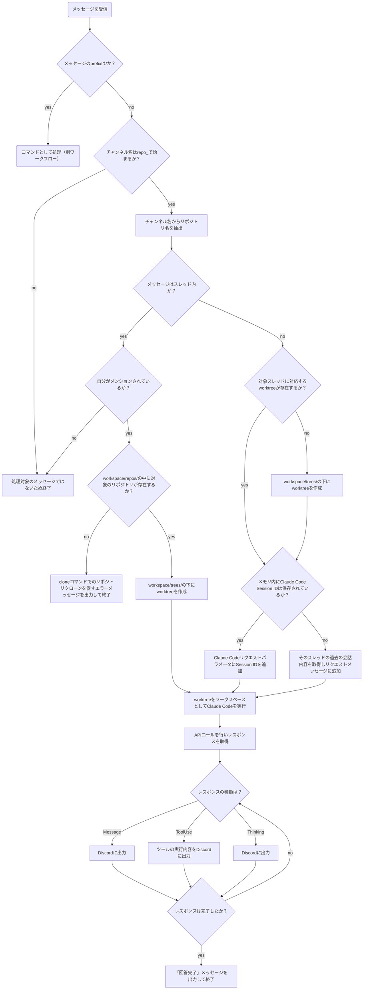
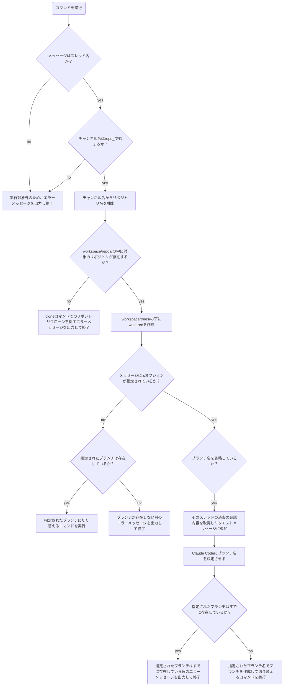
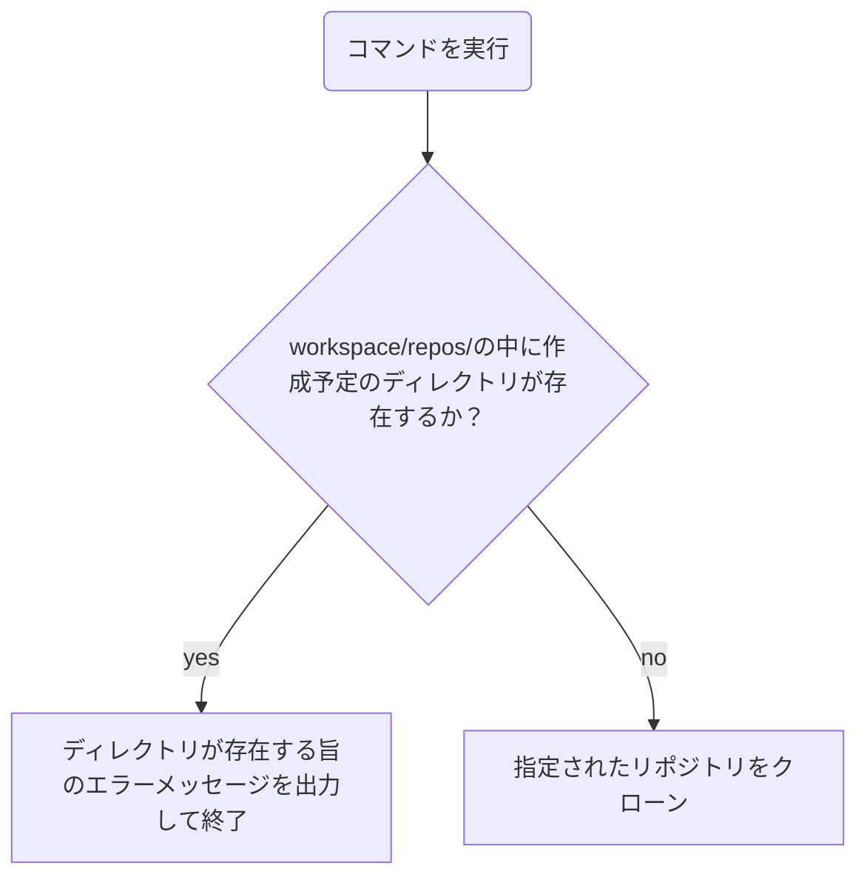
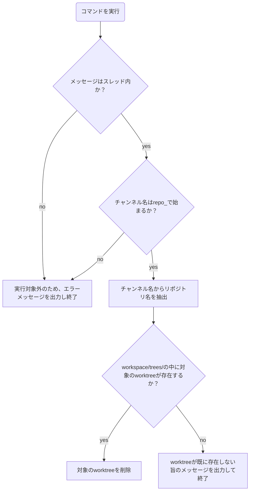

# メインワークフロー

## on_messageワークフロー

### 補足

- Jのworktreeは、リポジトリのmainブランチから作成される。worktreeの名前は `workspace/trees/<チャンネルID>/<スレッドID>` となる。
- Qのツール出力は、1回のメッセージ処理につき最新3件のもののみ表示。
- P, Q, Rの出力は、投稿がチャンネルかスレッド内かによって適切な場所に行われる。
- Xの過去の会話内容は最大30件、最大1000文字のいずれかの制限を超えないように取得される。いずれも超えない場合、会話全文が取得される。

# commandワークフロー

## switchコマンドワークフロー

スレッド内でのみ実行可能なコマンドです。指定されたbranchに切り替えます。`-c`オプションを指定すると、新しいブランチの作成を行います。
`-c`オプション指定時のみブランチ名を省略できます。省略した場合、Claude Codeに過去のスレッドの内容を元にブランチ名を決定させます。

Usage: `/switch [-c] <branch_name?>`

### 補足

- Oの過去の会話内容は最大30件、最大1000文字のいずれかの制限を超えないように取得される。いずれも超えない場合、会話全文が取得される。

## cloneコマンドワークフロー

指定されたリポジトリをクローンします。
第二引数は省略可能で、指定しない場合はリポジトリ名と同じ名前のディレクトリにクローンされます。

Usage: `/clone <repository_url> <directory?>`

## quitコマンドワークフロー

スレッド内でのみ実行可能なコマンドです。現在のスレッドに対応するworktreeを削除します。
Usage: `/quit`

